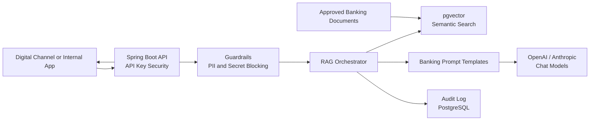

# spring-ai-banking-assistant

Production-grade Spring AI reference implementation for safe Retrieval-Augmented
Generation in retail banking.

The project demonstrates how a regulated bank can expose generative AI through
approved knowledge sources, vector search, citations, guardrails, audit logging,
provider routing, and streaming responses.

## Architecture



## Capabilities

| Capability | Implementation |
| --- | --- |
| Account FAQs | Sample account knowledge base and RAG endpoint |
| Loan FAQs | Loan eligibility and underwriting policy guidance |
| Credit Card FAQs | Billing, lost card, and sensitive-data guidance |
| NEFT/RTGS FAQs | Transfer education and status escalation rules |
| Banking Policies | Responsible AI, privacy, and escalation policies |
| Branch Information | Branch service and IFSC guidance |
| Multi-model support | OpenAI and Anthropic ChatClient beans |
| Streaming responses | Server-sent events endpoint |
| Audit logging | PostgreSQL audit table with question hashes |
| Hallucination prevention | Refusal when retrieved context is insufficient |

## Tech Stack

| Layer | Technology |
| --- | --- |
| Runtime | Java 21 |
| Framework | Spring Boot 3.x |
| AI | Spring AI, OpenAI, Anthropic |
| Retrieval | PostgreSQL, pgvector |
| API Docs | Swagger / OpenAPI |
| Security | API key filter, stateless Spring Security |
| Platform | Docker, Kubernetes |
| Build | Maven |

## Quick Start

Set API keys:

```bash
export OPENAI_API_KEY=your-openai-key
export ANTHROPIC_API_KEY=your-anthropic-key
export BANKING_ASSISTANT_API_KEY=dev-api-key
```

Run locally:

```bash
mvn clean package
docker compose up --build
```

URLs:

- API: `http://localhost:8080/api/v1`
- Swagger: `http://localhost:8080/swagger-ui.html`
- Health: `http://localhost:8080/actuator/health`

## Example Chat Request

```bash
curl -X POST http://localhost:8080/api/v1/assistant/chat \
  -H "Content-Type: application/json" \
  -H "X-API-Key: dev-api-key" \
  -d '{
    "question": "Can you explain how NEFT differs from RTGS?",
    "provider": "OPENAI",
    "sessionId": "demo-session-1"
  }'
```

## Streaming Request

```bash
curl -N -X POST http://localhost:8080/api/v1/assistant/chat/stream \
  -H "Content-Type: application/json" \
  -H "X-API-Key: dev-api-key" \
  -d '{
    "question": "What should a customer do if a credit card is lost?",
    "provider": "ANTHROPIC",
    "sessionId": "demo-session-2"
  }'
```

## Document Ingestion

Sample banking documents are under:

```text
src/main/resources/banking-documents
```

Ingest approved content:

```bash
curl -X POST http://localhost:8080/api/v1/documents/ingest \
  -H "Content-Type: application/json" \
  -H "X-API-Key: dev-api-key" \
  -d '{
    "documentId": "neft-rtgs-faq-v1",
    "title": "NEFT and RTGS FAQs",
    "category": "NEFT_RTGS_FAQ",
    "source": "retail-banking-policy",
    "content": "NEFT is batch settled. RTGS is intended for high-value real-time gross settlement transfers."
  }'
```

## Folder Structure

```text
spring-ai-banking-assistant/
|-- .github/workflows/ci.yml
|-- docs/
|-- k8s/
|-- src/main/java/com/banking/ai/
|   |-- config/
|   |-- domain/
|   |-- dto/
|   |-- security/
|   |-- service/
|   `-- web/
|-- src/main/resources/
|   |-- banking-documents/
|   `-- db/migration/
|-- Dockerfile
|-- docker-compose.yml
|-- pom.xml
`-- README.md
```

## Regulated AI Design Notes

- The assistant answers only from retrieved banking documents.
- Unsafe requests are refused before model invocation.
- Raw customer questions are not stored; audit logs store hashes.
- Responses include citations for operational review.
- Provider choice is explicit per request, with configurable defaults.
- Account-specific and transaction-specific servicing is escalated to
  authenticated banking channels.

## Documentation

- [API](docs/api.md)
- [Guardrails](docs/guardrails.md)
- [Document ingestion](docs/ingestion.md)

## License

MIT. See [LICENSE](LICENSE).
